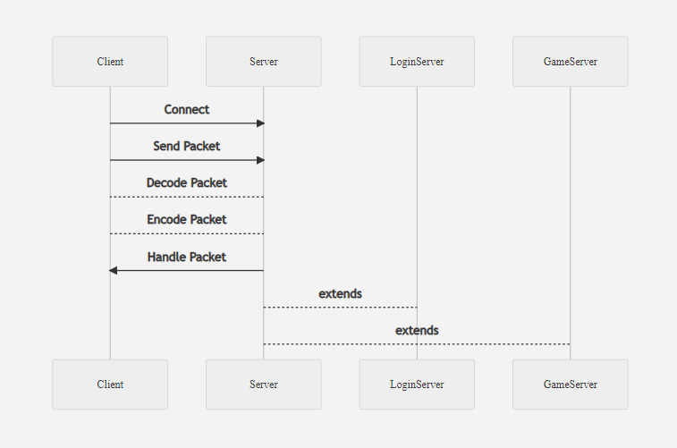

# Open-Source CrossFire Server.

**Hello everyone!** This is an **ambitious project**, initially developed by just one developer. 
We have many goals yet to be achieved and we would **appreciate** any and all help.
We are happy to make the **source code** of our server available, many of the Enum already created are in correct order and with their proper typing for writing packages.
Use the server as you wish, we have no restrictions as long as you assign credits to this repository.

## Documentation and others.
> The documentation will be done over time, but the initial code is very clean.

## Authentication on Login Server.

The project still does not have any management for databases or similators, the same to simulate the login server uses a class with statistical data for the purpose of tests. Later on, a whole interface for this management will be implemented. 

Below is the data to perform the authentication.

|                |LOGIN                          |PASSWORD                         |
|----------------|-------------------------------|-----------------------------|
|Account|`'oreki'`            |`'oreki'`    

## UML Diagrams

**A small sketch of the server's network.**

