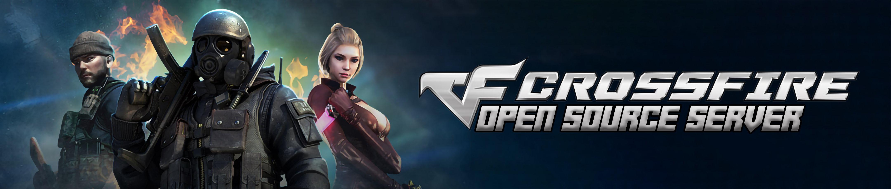

English | [Português](README.pt-PT.md)

# CrossFire Emulator (C# Version)
**Hello everyone!** This is an **ambitious project**. We have many goals yet to be achieved and we would **appreciate** any and all help. We are happy to make the **source code** of our server available, many of the Enum already created are in correct order and with their proper typing for writing packages. Use the server as you wish, we have no restrictions as long as you assign credits to this repository.

## Overview
This is a project being developed by the community, and is not affiliated with any of the companies belonging to [Neowiz](https://www.neowiz.com/), [Playgra (Arario)](http://playgra.com/), [VTC Game](https://www.vtcgame.vn/), [Tencent](https://www.tencent.com/), [Z8Games](https://www.z8games.com/), [GameClub](https://www.gameclub.ph/) and [LYTO](https://www.lytogame.com/). The project is developed with .NET Core 3.1.

## How to Run the Server.
- **Download the Client of West/NA**
- **Fork our Rest API** | [Click Here](https://github.com/ZettaStudios/crossfire-api)
- **Fork our Server**
- **Change the Client File** | Change files to point to our server in ``version.ini``, after change the same, host the same file locally using xampp or other and change ``localinfo.dat`` to you local website.
- **Run our Rest API** | Use the command line `npm start` and check if is running correctly.
- **Run Login Server**
- **Try to enter In Game.**

## Authentication on Login Server
The project still does not have any management for databases or simulators, the same to simulate the login server uses a static data for the purpose of tests. Later on, a whole interface for this management will be implemented.

Below is the data to perform the authentication.

| |LOGIN|PASSWORD|
|---|---|---|
|Account|`oreki`|`oreki`

## UML Diagrams
A small sketch of the server's network.

